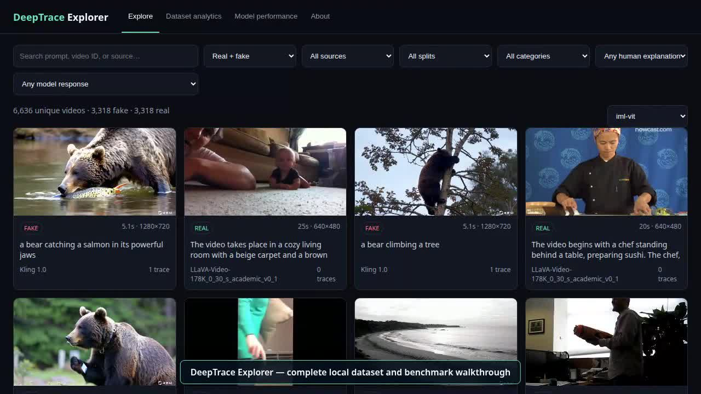

# DeepTracerReward Explorer and lightweight baselines

This repository is an applied-R&D companion to
**[“Learning Human-Perceived Fakeness in AI-Generated Videos via Multimodal
LLMs”](https://arxiv.org/pdf/2509.22646)** ([arXiv record](https://arxiv.org/abs/2509.22646)).
It provides:

- a local, FiftyOne-inspired explorer for the DeepTraceReward dataset;
- strict evaluation for classification, spatial/temporal grounding, and
  diagnostic explanation similarity;
- lightweight Track B localizers and Track C video-VLM inference runners; and
- the paper-sharing deck and a recorded explorer walkthrough.

The original videos, annotations, third-party model repositories, and checkpoints
are deliberately not committed. They remain governed by their original licenses.

## Dataset setup

Download the official dataset from
[DeepTraceReward/RewardData on Hugging Face](https://huggingface.co/datasets/DeepTraceReward/RewardData):

```bash
git clone https://huggingface.co/datasets/DeepTraceReward/RewardData dataset-download
cp dataset-download/all_data.json .
unzip dataset-download/real_video.zip -d .
cat dataset-download/videos.zip.00* > /tmp/deeptrace-videos.zip
unzip /tmp/deeptrace-videos.zip -d .
```

The project expects this local layout:

```text
RewardData/
├── all_data.json
├── videos/          # generated videos
├── real_videos/     # real comparison videos
├── predictions/     # JSONL model outputs
├── app.py
└── static/index.html
```

The annotation JSON contains 7,652 rows representing 6,636 unique videos:
3,318 generated and 3,318 real. A generated video may have several expert trace
annotations, so all splitting and evaluation must use `video_id`, never row index.
The official test split contains 664 unique videos: 332 fake and 332 real.

## Run the explorer

```bash
conda activate deeptracereward
python app.py
```

Open <http://127.0.0.1:8000>. The explorer supports dataset browsing, video and
annotation detail, expert/model box overlays, prediction-agreement filters,
dataset analytics, per-model performance, failure inspection, and explanation
comparison. The full illustrated guide is [`readme.html`](readme.html).

### Explorer walkthrough

[](assets/slides/DeepTrace_Explorer_Demo.mp4)

Click the preview above or
[open the MP4 walkthrough directly](assets/slides/DeepTrace_Explorer_Demo.mp4).
It demonstrates matched and mismatched Track B/Track C predictions, expert and
model bounding boxes, IoU inspection, dataset analytics, and model-performance
pages.

## Environment and inference

```bash
conda activate deeptracereward
python -m pip install -r inference/requirements.txt
```

Track C compact video-VLM example:

```bash
python inference/run_vlm.py --model qwen2.5-vl-3b --split test \
  --output predictions/qwen2.5-vl-3b-v2-test.jsonl --resume
python inference/evaluate_predictions.py \
  predictions/qwen2.5-vl-3b-v2-test.jsonl
python inference/evaluate_explanations.py \
  predictions/qwen2.5-vl-3b-v2-test.jsonl \
  --output predictions/qwen2.5-vl-3b-v2-test-explanations.json
```

Track B uses official TruFor and IML-ViT repositories/checkpoints that must be
installed locally under `third_party/`. See [`inference/TRACK_B.md`](inference/TRACK_B.md)
for exact paths, downloads, pilot commands, and resume behavior.

## Completed lightweight benchmark

All values below use the 664-video test split and the repository's strict scoring.
Missing grounding receives the worst score. Track B samples two frames per video;
Track C uses the model-specific runner configuration. These are out-of-domain,
pretrained transfer baselines—not official reproduction results.

| Track | Model | Accuracy ↑ | Fake acc. ↑ | Real acc. ↑ | Box IoU ↑ | Time distance ↓ |
|---|---|---:|---:|---:|---:|---:|
| B | TruFor | 47.590 | 1.205 | 93.976 | 13.962 | 38.497 |
| B | IML-ViT | 45.181 | 0.301 | 90.060 | 11.437 | 40.914 |
| C | Qwen2.5-VL-3B (4-bit) | 66.566 | 56.928 | 76.205 | 13.808 | 57.026 |
| C | VideoLLaMA3-2B (4-bit) | 47.892 | 10.542 | 85.241 | 0.000 | 93.520 |
| C | SmolVLM2-500M | 18.373 | 15.361 | 21.386 | 0.000 | 100.000 |

The split accuracies reveal a key failure mode that overall accuracy hides:
both Track B localizers mostly predict REAL. Qwen2.5-VL-3B is the strongest compact
transfer baseline, but remains well below a task-trained system for explanation
and reliable grounding. That gap is evidence that the expert annotations are a
challenging evaluation target, not evidence that generic pretrained models solve
human-perceived video fakeness.

Marlin-2B is excluded from comparative claims because 651/664 rows failed at
runtime. Retaining this failed run in the explorer is useful for auditability, but
it is not a valid benchmark result.

## Repository map

| Path | Purpose |
|---|---|
| `app.py`, `static/index.html` | Local explorer server and interface |
| `inference/run_vlm.py` | Resume-safe Track C inference |
| `inference/run_track_b.py` | Resume-safe Track B orchestration |
| `inference/track_b_worker.py` | Isolated TruFor/IML-ViT adapters |
| `inference/evaluate_predictions.py` | Strict task and grounding metrics |
| `inference/evaluate_explanations.py` | Reproducible diagnostic text metrics |
| `predictions/` | Small completed JSONL results and metric summaries |
| `DeepTraceReward_Paper_Sharing.pptx` | Latest edited paper-sharing deck |

To regenerate the optional walkthrough, install Playwright, ensure Chrome or
Chromium is available, and run `python record_explorer_demo.py`. The script uses
the active Python environment and accepts `--browser`, `--port`, and `--output`.

## Evaluation caveats

- Explanation similarity metrics are diagnostics, not semantic correctness.
  The paper's explanation protocol uses a 0/0.5/1 judge; a human or equivalently
  specified judge is required for a direct comparison.
- Only 277 of 440 test fake-trace rows contain written expert explanations,
  covering 212 of the 332 fake videos.
- Boxes from still-image localizers are not the same object as movement-centric
  human-perceived traces; Track B therefore measures transfer under a sparse,
  explicitly documented two-frame protocol.
- Do not tune thresholds on the test set or merge runs with different prompts.

See [`model_recommendations.md`](model_recommendations.md) for model selection and
[`predictions/README.md`](predictions/README.md) for the JSONL schema.
